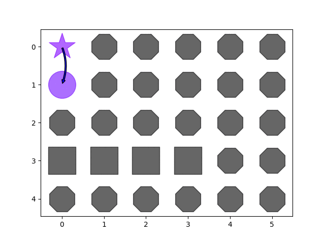

## PathFinding_PyAstar
### Please take a look at the [document](./document.pdf) to get usage or detail explainations of the program
### Animation
- star sign: currently searching node
-  X   sign: node in the closed list
-  O   sign: node in the open list
-  square : barrier
-  octagan: node has not been reached
-  color  : estimated cost for the path going through this node
-  arrow  : path
- 
